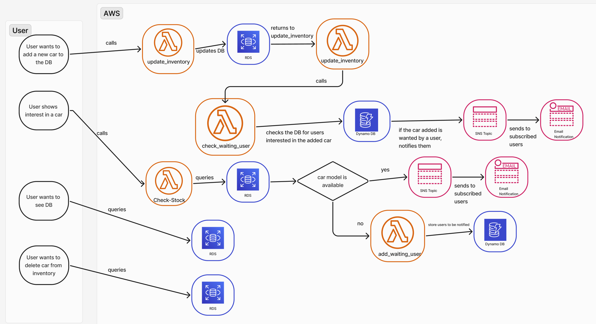
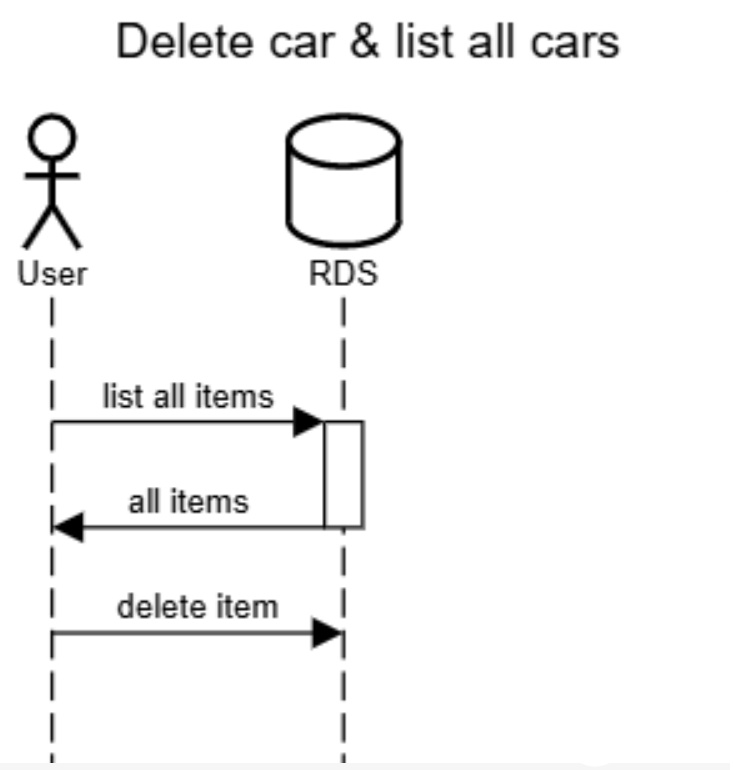
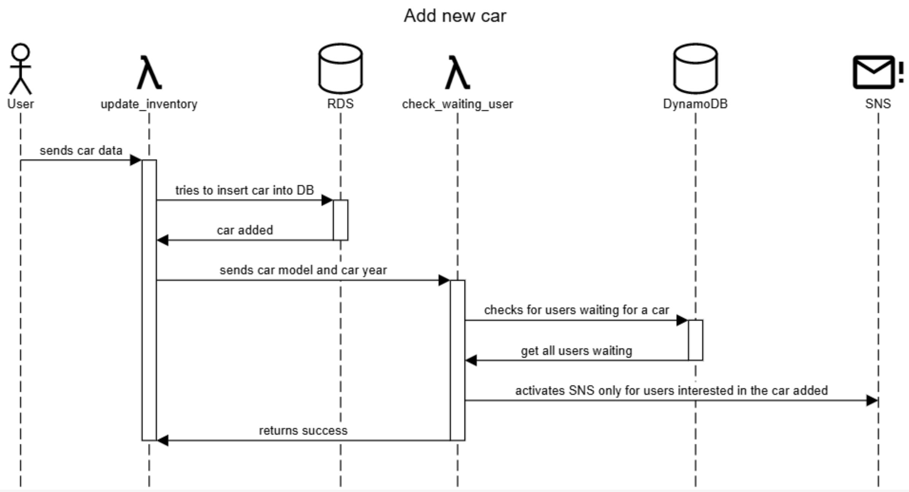
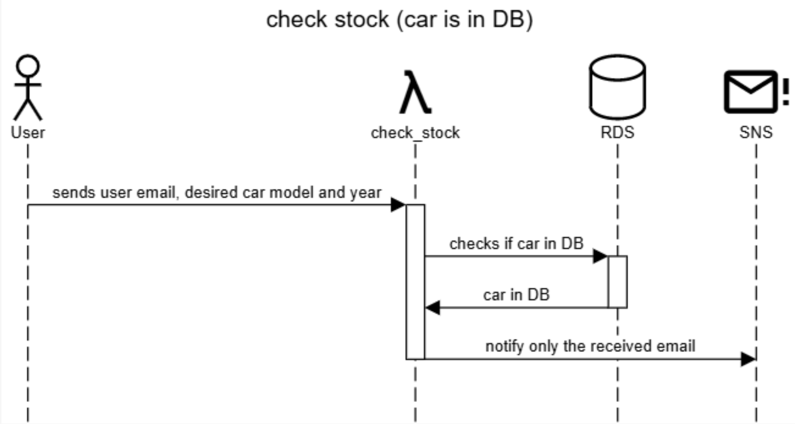
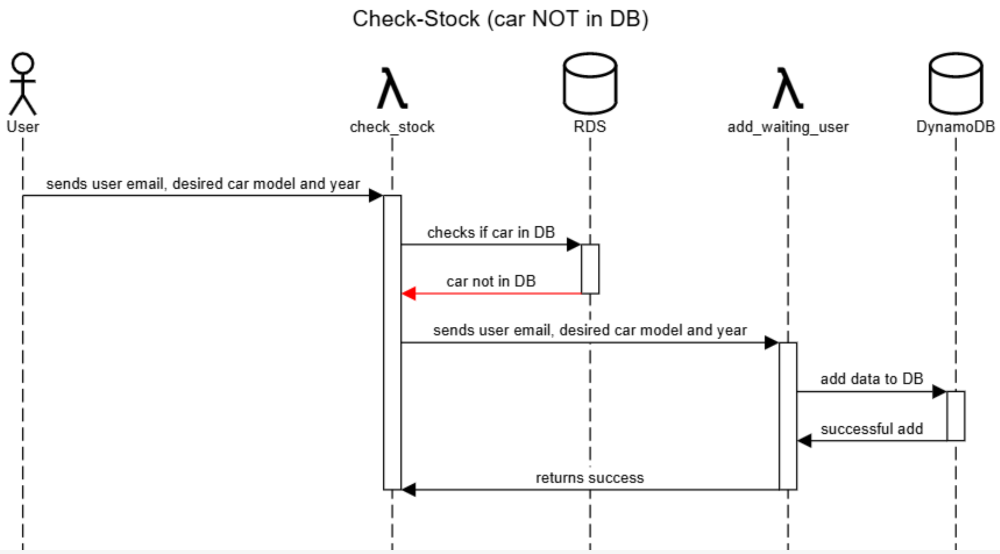

# INF1304-Trabalho2
Projeto para INF1304 usando AWS.

# Membros
- Bernardo Luiz Bach 1613231
- Francisco Meirelles Fleury 2210641
- Ricardo Bastos Leta Vieira 2110526

> Usamos a conta do Bernardo para montar as coisas no AWS

# Diagrama de bloco 


# Diagramas de sequência UML
## Delete and list cars


## Update inventory (add car to RDS)


## Check-Stock
### Car is in DB


### Car is NOT in DB


# Instruções de instalação
1. Vá para a pasta Client 
2. Rode o script ```setup.sh``` que cria um ambiente virtual do python e instala as bibliotecas necessárias
# Instruções de uso
1. Vá para a pasta Client
2. Rode ```python3 interface.py``` 
